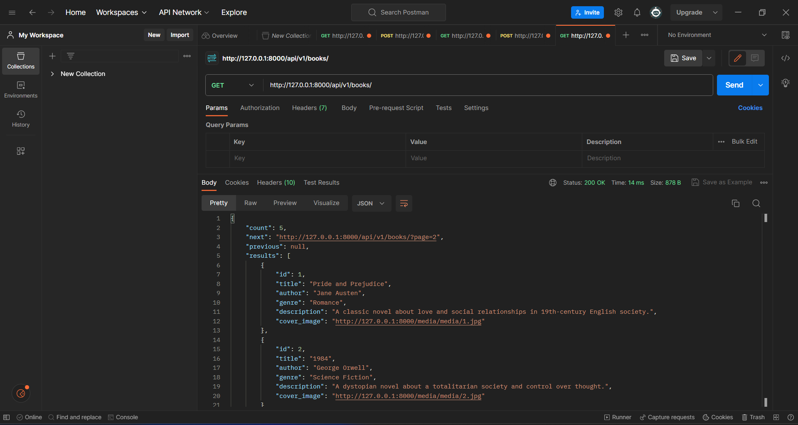

# BookApp

## Документация для API управления книгами

> Добро пожаловать в документацию по API управления книгами. Это API позволяет управлять информацией о книгах. Здесь вы найдете подробности о доступных конечных точках, разрешениях и примерах использования.


**Пример программы так работает.**

## Содержание
- Модели
- Разрешения
- Представления
- URL

## Установка

**Для установки программы, выполните следующие шаги:**

1. Установите Python на вашу систему, если он еще не установлен. Вы можете скачать Python с официального сайта: https://www.python.org/downloads/

2. Клонируйте репозиторий с GitHub:
 ```bash
$  git clone https://github.com/Humoyun004/BookApp.git
```

3. Перейдите в директорию с программой:
cd BookApp 

## Использование
**После того, как вы загрузили django, перейдите в каталог клонированного репо и выполните следующую команду**
```bash
$ python manage.py makemigrations
```

**Это создаст все файлы миграции (миграции базы данных), необходимые для запуска этого приложения.**

**Теперь, чтобы применить эту миграцию, выполните следующую команду**
```bash
$ python manage.py migrate
```
**Один последний шаг, и тогда наше приложение Book будет запущено. Нам нужно создать пользователя-администратора для запуска этого приложения. В терминале введите следующую команду и укажите имя пользователя, пароль и адрес электронной почты для пользователя-администратора.**
```bash
$ python manage.py createsuperuser
```
 **Запустите программу с помощью команды:**
```bash
$ python manage.py runserver
```
## Модели
- **Модель Book представляет книгу с следующими атрибутами:**
    - **title** (CharField): Название книги (максимальная длина: 200 символов).
    - **author** (CharField): Автор книги (максимальная длина: 200 символов).
    - **genre** (CharField): Жанр книги (максимальная длина: 100 символов).
    - **description** (TextField): Подробное описание книги.
    - **cover_image** (ImageField): Обложка книги (хранится в каталоге "media/").
    - **user** (ForeignKey): Внешний ключ к модели User, указывающий на владельца книги.

## Разрешения

### IsAdminOrReadOnly
- Этот класс разрешений позволяет только аутентифицированным пользователям с правами администратора выполнять небезопасные методы (например, POST, PUT, DELETE).
- Для всех пользователей разрешены безопасные методы (например, GET).

### IsOwnerOrReadOnly
- Этот класс разрешений позволяет владельцу объекта изменять его.
- Для всех пользователей разрешены безопасные методы (например, GET).

## Представления (View)

### BookList (ListCreateAPIView)
- Конечная точка: api/v1/books/
- Методы: GET (Список), POST (Создание)
- Разрешения: IsAuthenticatedOrReadOnly
- Пагинация: Номер страницы (размер страницы по умолчанию: 2, максимальный размер страницы: 10000)

### BookUpdate (RetrieveUpdateAPIView)
- Конечная точка: api/v1/books/<int:pk>/
- Методы: GET (Получение), PUT (Обновление)
- Разрешения: IsOwnerOrReadOnly

### BookDestroy (RetrieveDestroyAPIView)
- Конечная точка: api/v1/bookdelete/<int:pk>/
- Методы: GET (Получение), DELETE (Удаление)
- Разрешения: IsAdminOrReadOnly

## URL
- **api/v1/books/**: Список и создание книг.
- **api/v1/books/<int:pk>/**: Получение и обновление книги по ID.
- **api/v1/bookdelete/<int:pk>/**: Получение и удаление книги по ID.
- **api/v1/drf-auth/**: URL аутентификации Django Rest Framework.

## Вклад
**Если вы хотите внести свой вклад в развитие приложения "BookApp", пожалуйста, следуйте этим шагам:**

1. Форкните репозиторий на GitHub.
2. Клонируйте ваш форк репозитория на локальную машину.
3. Создайте новую ветку для вашей функции или исправления ошибки.
4. Внесите изменения и сделайте коммиты с описательными сообщениями.
5. Отправьте ваши изменения в ваш форк репозитория.
6. Создайте pull request (запрос на включение) в основной репозиторий.

## Благодарности
- Фреймворк Django: https://www.djangoproject.com/
- Фреймворк Django-rest-framework: https://www.django-rest-framework.org/

## Дополнительные ресурсы
- **Документация Django:** https://docs.djangoproject.com/

## Контакты
**Если у вас есть вопросы или предложения относительно приложения "Book", пожалуйста, свяжитесь с нами по адресу humoyunakbaraliev1@gmail.com. Мы ценим ваше мнение!**


